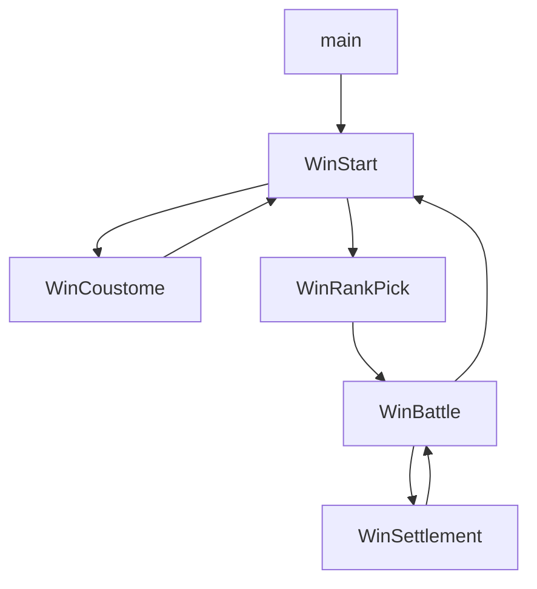

# Battle City Design

## 字体

特别感谢下载站[Press Start 2P](https://www.onlinedown.net/soft/1121982.htm)  

## 按键操作

- 玩家一

| 操作  | `keyCode(keydown)` | `key(keydown)` |
| :---: | :----------------: | :------------: |
|  左   |         65         |       a        |
|  下   |         83         |       s        |
|  上   |         87         |       w        |
|  右   |         68         |       d        |
| 单发  |         71         |       g        |
| 连发  |         72         |       h        |
| 暂停  |         66         |       b        |

- 玩家二

| 操作  | `keyCode(keydown)` | `key(keydown)` |
| :---: | :----------------: | :------------: |
|  左   |         37         |       ←        |
|  下   |         40         |       ↓        |
|  上   |         38         |       ↑        |
|  右   |         39         |       →        |
| 单发  |         75         |       k        |
| 连发  |         76         |       l        |

## 地图设计

- 画布大小`516*456`
- 地图大小 `416*416`（单位像素） 游戏中心大小（坦克活动区域） `416*416`
- `13*13`个大方块 （一个坦克大小） `32*32`
- 一个大方块由`4*4`个小方块构成 `16*16`
- 界面上部分 `516*117`
- `BATTLE CITY` log 大小 `376*136` 位置`(0,0)` 居中显示
- `GAME OVER` 大小 `248*160` 位置 `(0,136)`
- 留白（不绘制的区域）

  - 上 `20`
  - 左 `35`
  - 右 `65`
  - 下 `20`
- 地方坦克数量标识大小 `14*14`
- 己方 boss 位置 `(192，384)` `(6, 12)`

## 子弹设计

高等级子弹具有低等级子弹的效果

| 子弹等级 | 叙述                               |
| -------- | ---------------------------------- |
| 1        | 可以打碎砖块，每次消除8px宽度      |
| 2        | 可以打碎砖块，每次消除16px         |
| 3        | 可以同时发射2颗                    |
| 4        | 可以打碎铁块，五角星最高可升级4级  |
| 5        | 子弹可以打碎铁块，通过获得`🔫` 提升 |
| 6        | 可以消除草丛                       |

## 游戏界面

- 开始界面

- 自定义界面

- 关卡界面

- 对战界面

- 结算界面

## 游戏坐标

- 游戏采用左上角为原点的坐标系

- 坦克每次转向时，自动对齐

## Battle City 流程图

Battle city 场景切换流程图

