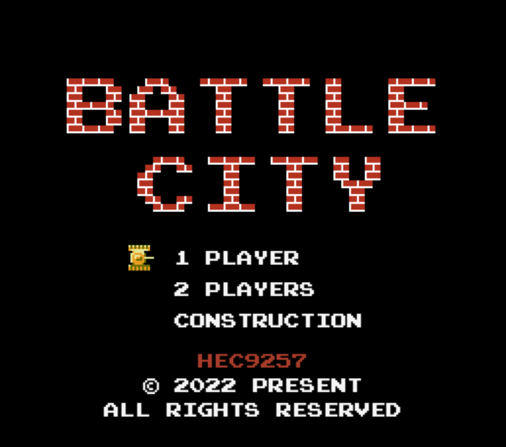

<div style="text-align:center;" align="center">

# Battle City

<!-- https://shields.io/ -->


</div>

[Battle city](https://github.com/hec9527/BattleCity)是经典的红白机游戏之一，其操作简单，玩法经典，经久不衰。本项目使用 `h5` + `ts` + `canvas` 原滋原味的复刻了红白机的游戏逻辑和流程。项目包含多个分支对应不同时期的历史版本。~~同时配有有非常完善的开发文档及日志~~，梳理实现思路和优化方向，~~所有代码经过严格的代码测试~~

## 游戏特色

游戏还原度超过90%，同时兼容PC和移动端，随时随地即可享受经典中的经典

## 在线食用

[http://tank.hec9527.top/](http://tank.hec9527.top/)

## 本地享用

```zsh
git clone https://github.com/hec9527/BattleCity.git

cd BattleCity

pnpm install

npm run dev
```

## Roadmap


- [ ] 修复：地图编辑界面，生成多个河流时，河流的状态不统一
- [ ] 修复：我方坦克出生后获得保护太长，应该适当缩短
- [ ] 修复：奖励生成时应该避免生成在坦克附近
- [ ] 特性：页面隐藏或者后台的时候，自动暂停游戏
- [ ] 特性：高级子弹可以消灭森林
- [ ] 特性：新增竹筏，获得后可以过河
- [ ] 特性：坦克在冰块上移动后会继续向前移动一小段
- [ ] 特性：游戏开始时可以选择是否允许敌方获得奖励，目前可以通过设定全局属性修改（`window.allowEnemyPick = false`）
- [ ] 特性：新增其它外设适配（手柄控制）
- [ ] 其它：打包安卓应用，IOS应用
- [ ] 其它：增加`github action`自动打包发布

## 可以做哪些贡献

- 检查地图界面是否正确
- 游戏参数是否合理
- 游戏bug上报

## 游戏截图

[查看关卡截图][./images]



## 协议

[MIT](./LICENSE)