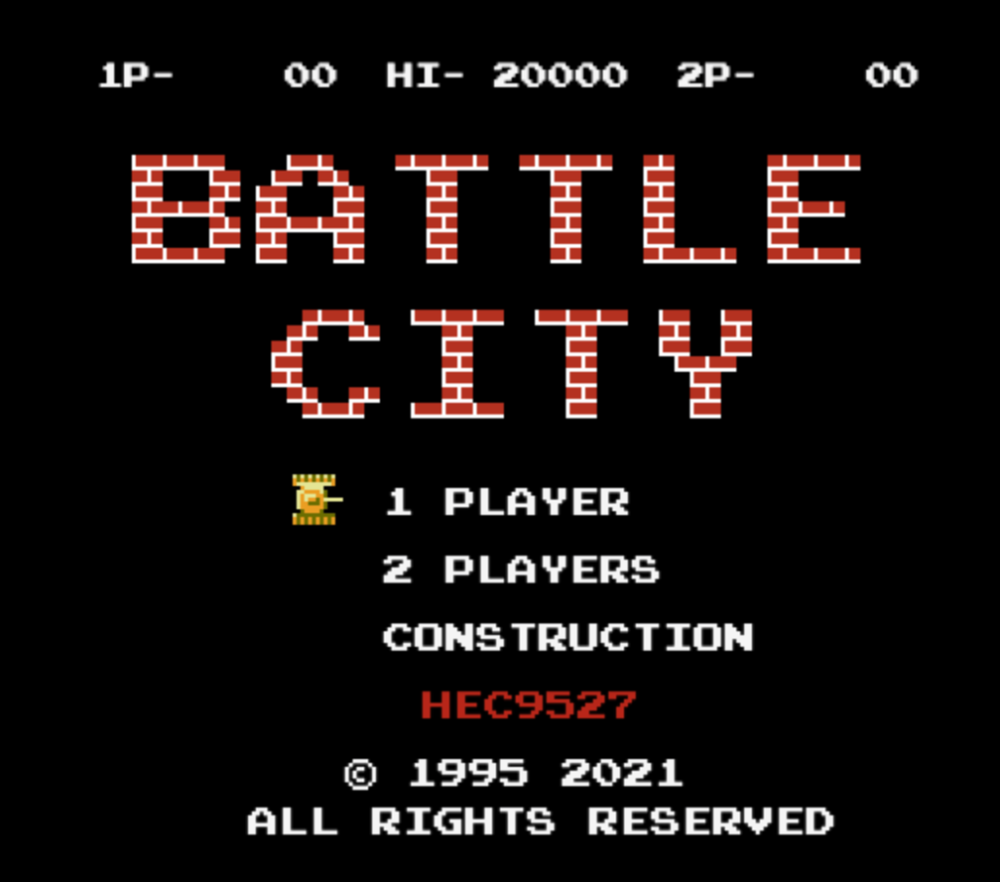

# Battle City

<!-- https://shields.io/ -->

[Battle city](https://github.com/hec9527/BattleCity)是经典的红白机游戏之一，其操作简单，玩法经典，经久不衰。本项目使用 `h5` + `ts` + `canvas` 原滋原味的复刻了红白机的游戏逻辑和流程。项目包含多个分支对应不同的游戏实现版本`ts ? js`。同时配有有非常完善的开发文档及日志，梳理实现思路和优化方向，~~所有代码经过严格的代码测试~~

## 游戏截图

## 关卡数据

[关卡精灵图](https://spritedatabase.net/game/3101)
