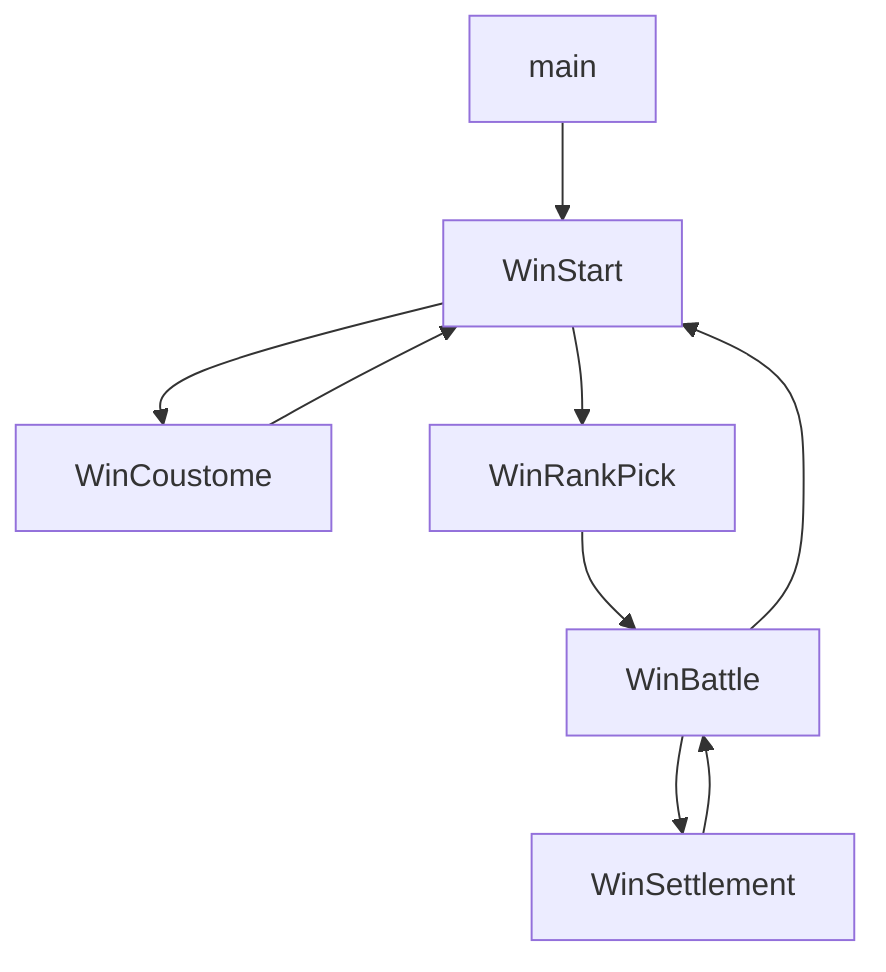

# Battle City Design

battle city 设计文档

## 字体

字体采用 `press start` 或者 `press start 2p`, 部分字体采用图片填充

在此特别感谢下载站[onlinedown](https://www.onlinedown.net/soft/1121982.htm)提供的字体文件

## 按键操作

- 玩家一

  | 操作  |  ⇦  |  ⇧  |  ⇨  |  ⇩  |  A  |  B  | start |
  | :---: | :-: | :-: | :-: | :-: | :-: | :-: | :---: |
  | `key` | `a` | `w` | `d` | `s` | `g` | `h` |  `b`  |

- 玩家二

  | 操作  |  ⇦  |  ⇧  |  ⇨  |  ⇩  |  A  |  B  |
  | :---: | :-: | :-: | :-: | :-: | :-: | :-: |
  | `key` | `←` | `↑` | `→` | `↓` | `k` | `l` |

## 地图设计

- 画布大小`516*456`

- 坦克活动区域 `416*416`

- 地图填充`13*13`个大方块，每个方块`32*32`

- 一个大方块由`4*4`个小方块构成 `16*16`

- 界面上部分 `516*117`

- `BATTLE CITY` log 大小 `376*136` 位置`(0,0)` 居中显示

- `GAME OVER` 大小 `248*160` 位置 `(0,136)`

- 留白（坦克活动之外的区域）

  - 上 `20`

  - 左 `35`

  - 右 `65`

  - 下 `20`

- 敌方坦克数量标识大小 `14*14`
- 己方 boss 位置 `(192，384)` 或则索引 `[6, 12]`

## 子弹设计

高等级子弹具有低等级子弹的效果

| 子弹等级 | 叙述                                                    |
| -------- | ------------------------------------------------------- |
| 1        | 可以打碎砖块，每次消除 8px 宽度                         |
| 2        | 速度提高                                                |
| 3        | 每次消除 16px                                           |
| 4        | 可以同时发射 2 颗， 可以打碎铁块，五角星最高可升级 4 级 |
| 5        | 子弹可以打碎铁块，通过获得`🔫` 提升                     |
| 6        | 可以消除草丛                                            |

## 游戏界面

- 开始界面

- 自定义界面

- 关卡界面

- 对战界面

- 结算界面

## 游戏坐标

- 游戏采用左上角为原点的坐标系

- 坦克每次转向时，自动对齐

## Battle City 流程图

Battle city 场景切换流程图

